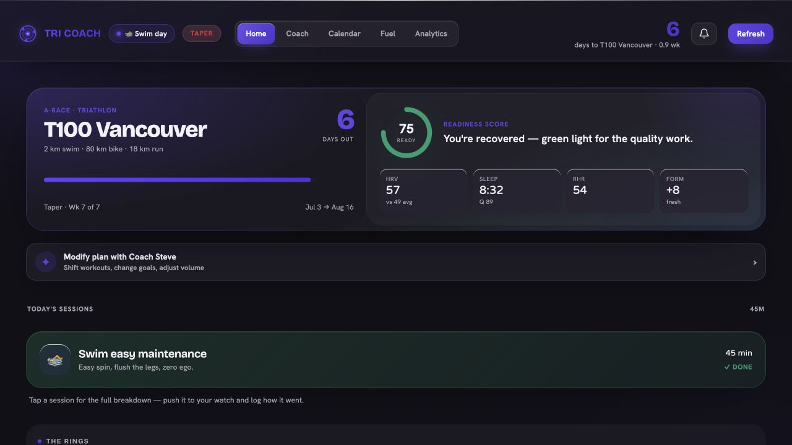
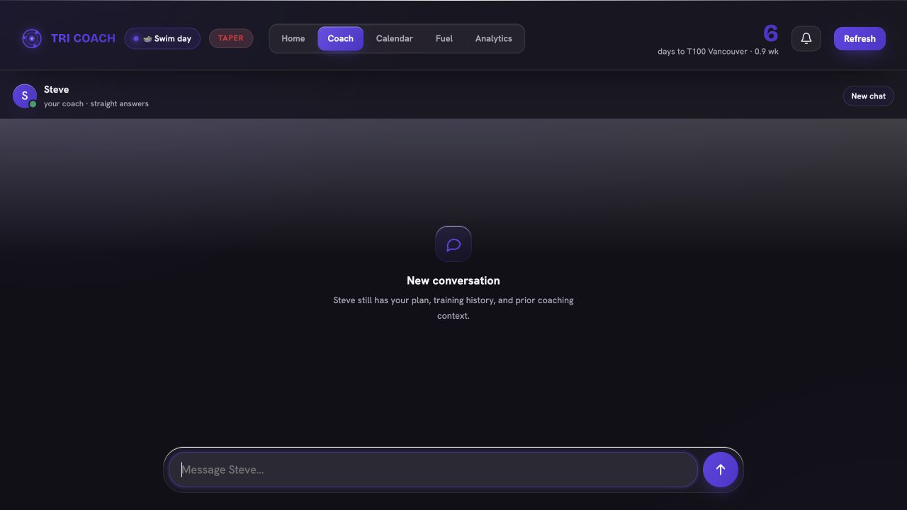
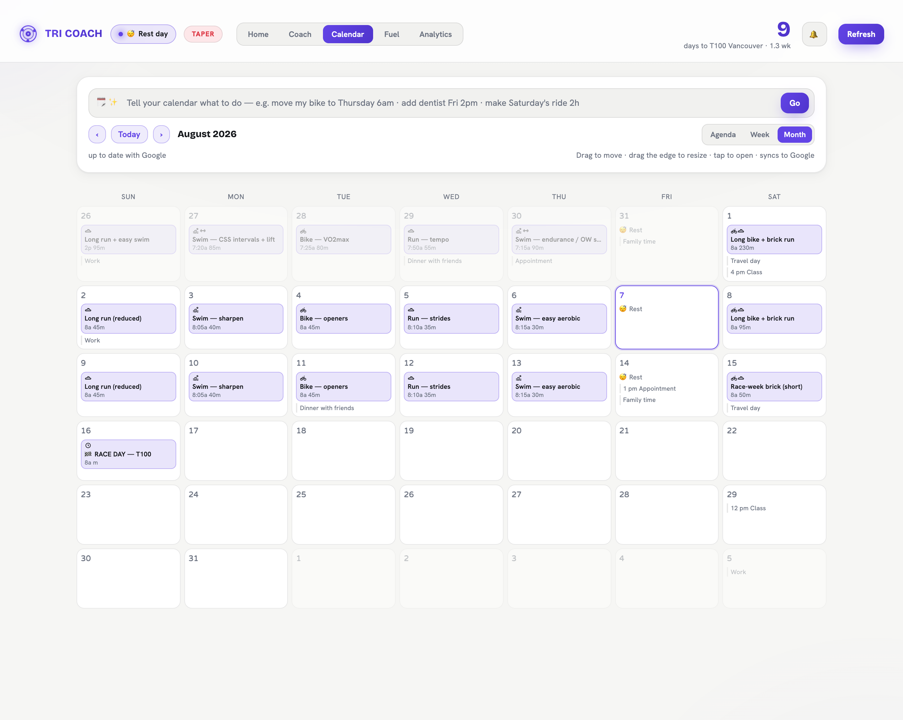
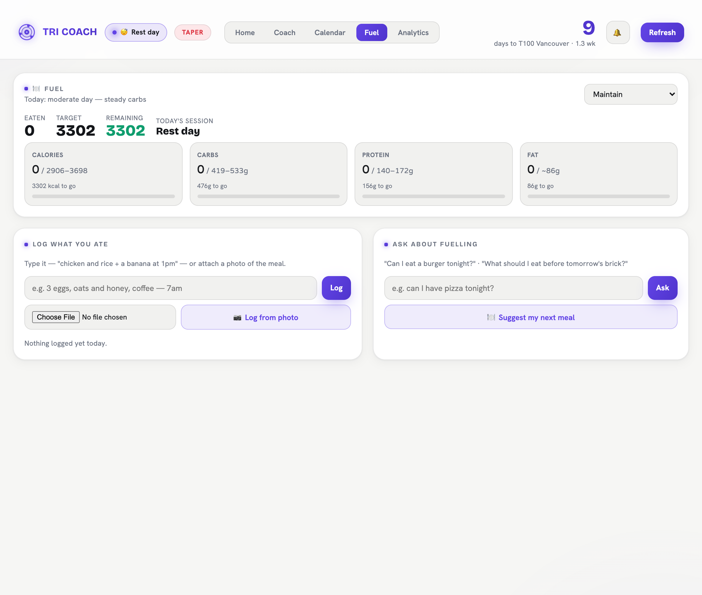
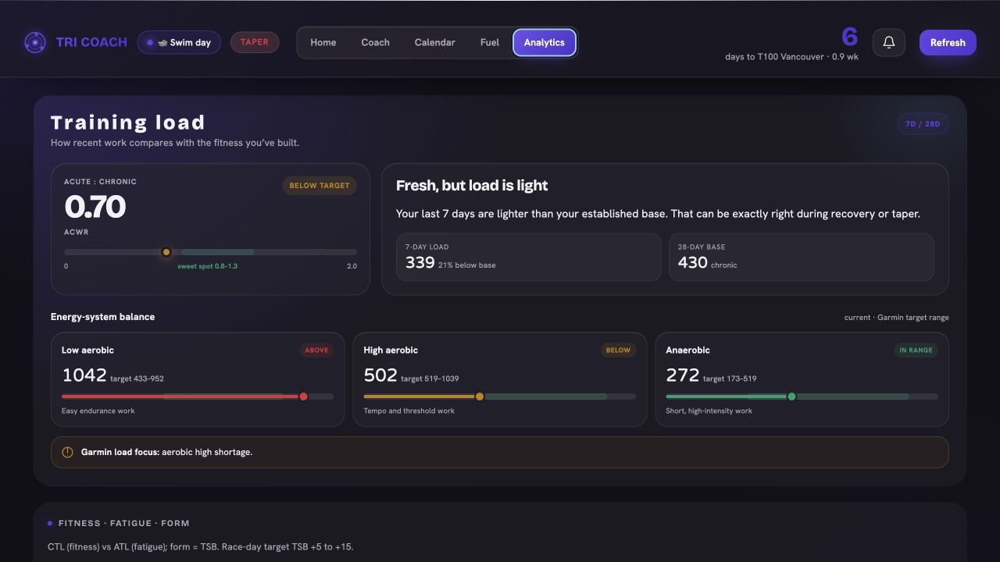
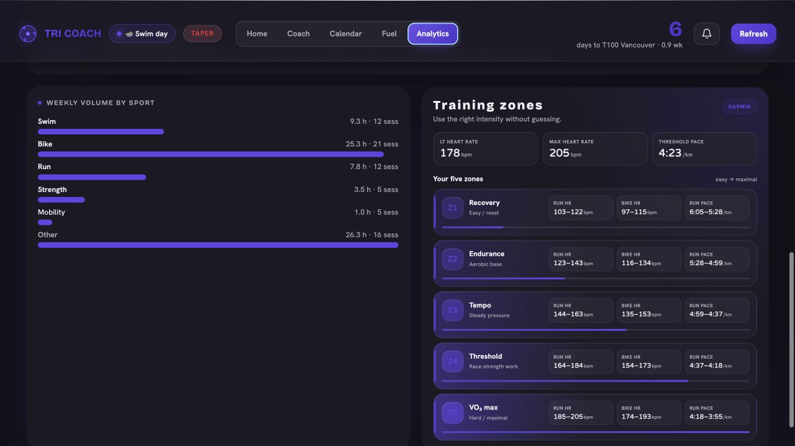

# Tri Coach

A personal endurance-coaching app built around a single question I ask every
morning before training: *given how I actually slept and recovered, what should
I do today — and does it still fit the rest of my life?*

It pulls live Garmin recovery and training data, models readiness, runs a
periodized plan toward a race, and keeps two AI agents in the loop: a
conversational coach that can reprogram the plan, and a natural-language
calendar assistant that schedules workouts around a real calendar with two-way
Google sync. It runs as a responsive, installable PWA with an iOS-inspired
glass interface and is deployed on Fly.io. Built solo, with Claude Code and
OpenAI Codex doing most of the typing — see
[Built with AI, deliberately](#built-with-ai-deliberately).

Built for training toward **T100 Vancouver** (2.0 km swim / 80 km bike /
18 km run), but the engine is general to any endurance build.

> Status: actively used daily by one athlete (me). It's a real tool, not a demo —
> which is why the hosted instance is access-gated rather than a public link.

---

## Why I built it

I tried a lot of the obvious things first — Garmin Connect Premium, WHOOP, a
couple of paid triathlon coaching plans. They're all good at what they measure.
What none of them handled was *my actual life*.

Every one of them assumed my weeks were identical: same wake-up, same free
evenings, same willingness to be in the pool at 5am on a Tuesday. But an old
friend asks if I want to grab beers, I'm out until 2am, and the 5am session was
never happening. A rigid plan responds to that by turning the rest of the week
into a guilt trip and a pile of "missed" workouts.

I wanted the opposite: **a plan as fluid as the life it has to fit into.** One
that re-plans week to week around real work hours and real commitments, moves a
session instead of writing it off, tells me when I'm actually recovered enough to
go hard — and, crucially, *doesn't quietly decide for me*. An early version of
this app silently swapped a key VO2 session for a recovery spin because my HRV
looked low; I saw the easy session, went back to sleep, and later found the
numbers hadn't been that bad. That's why readiness in here is **advice, not a
veto** — the athlete makes the call.

So the design goals came out of frustration, not features:

- **The plan bends, the athlete doesn't get bullied.** Low recovery surfaces a
  warning and an easier option; it never rewrites your day behind your back.
- **Life is a first-class input.** Your real calendar drives scheduling —
  workouts land around a 9–4 workday and route around whatever else is on it.
- **Talk to it like a person.** "Move my bike to Thursday morning", "I'm at the
  driving range tonight", "only 45 min today, legs are cooked."
- **Every week is allowed to look different.** The plan is re-shaped around
  travel, illness, a big work week, or a late night — without losing the arc that
  gets you to the start line.

---

## The five tabs

### Home


The A-race hero carries the goal, the countdown, and where you sit in the block.
Below it the readiness score reads out of Garmin — HRV against your own rolling
baseline, sleep, resting HR, and form (TSB) — with a plain-English verdict rather
than a number to interpret. Then today's sessions, the four WHOOP-style rings
(each clickable into a full breakdown), proactive signals and recent activities.
Training load lives in Analytics, where there is enough room to explain it
properly instead of compressing it into another Home card.

Readiness advises; it never overrides. If recovery is poor the app says so and
offers an easier alternative when you push the session to your watch, but it will
not silently swap your training out from under you. That line was drawn after an
early version quietly downgraded a key workout and cost a good training day.

### Coach


A conversational coach (Claude) with the full picture: Garmin data, the plan, the
week's load, prior coaching turns, and your own stated constraints. It is direct
by design and cannot invent numbers — a missing metric is reported as missing.

The visible chat opens as a clean conversation every time the app launches or
resumes, so there is no transcript to scroll through. That is presentation only:
Steve keeps a private server-side window of previous turns plus dated, durable
memories such as availability, injuries, travel and equipment constraints. The
result is a fresh screen without an amnesiac coach. Automatic briefs are
event-driven rather than launch-driven — a new sleep/recovery day, synced workout
or completion log can trigger one; simply reopening the app cannot.

Replies stream into the conversation as Steve writes them. While fresh Garmin
context is being assembled, a compact glowing-avatar and bouncing-dot state keeps
the composer stable and makes the wait explicit without blocking the rest of the UI.

Race questions are routed through a structured, page-linked digest of the supplied
2026 Vancouver Athlete Guide. Steve knows the exact check-in schedule, transitions,
course/cutoffs and bike/run aid-station locations and products, while explicitly
refusing to invent serving volumes or variants the guide does not specify.

It will reprogram any upcoming day, rebuild a whole week around a constraint,
log sessions you did off-plan, propose calendar events from a passing mention,
and decide on its own what is worth remembering (availability, niggles, travel)
versus what is just chatter. It also follows an explicit set of load rules: state
the TSB target, hold the race-day taper between +5 and +15, name the tradeoff
when cutting volume, give easy sessions a hard ceiling rather than a range, and
never raise run volume to hit a load target when the Achilles is the limiter.

### Calendar


Training and life on one surface, synced two ways with Google Calendar. Agenda,
Week and Month views, with navigation back through previous weeks and months.
Workouts are written to Google as timed blocks, placed in the mornings around a
fixed 9–4 workday and routed around whatever is already booked.

Drag a session to move it and tap it to open the full breakdown — every calendar
change pushes straight to Google. Edits you make *in* Google flow back on next
open, resolved most-recent-edit-wins. Calendar owns placement, not prescription:
workout duration and contents can only be changed through Coach Steve, so a drag
cannot accidentally rewrite the training plan. The command bar at the top takes
plain English: "move my bike to Thursday 6am", "swap Tuesday and Friday", "add
dentist Fri 2pm".

### Fuel


Daily targets scale to the day's training and shift with a calorie goal
(deficit / maintain / surplus) that takes its cut from fat and non-training
carbohydrate while protecting protein. Meals log from free text or from a photo
of the plate.

The part that matters is intra-session fuelling, which is built against
intestinal transport limits rather than a flat carb number. Glucose is capped at
60 g/h (SGLT1) and fructose at 30 g/h (GLUT5); above 60 g/h total the mix is held
at 2:1, so 90 g/h lands exactly on both ceilings and nothing is prescribed that
cannot be absorbed. Drink concentration is held to 6–8% by mass and any carb
beyond what the bottle can carry is assigned to gels with plain water. Every plan
shows its arithmetic, states what it assumed about product composition, lists the
labels to verify, and carries an abort protocol for GI distress.

Custom fueling questions use a shared audit contract in both Fuel and Coach:
resolve the exact race/training leg, distinguish table-salt mass from sodium,
inventory every bottle/flask/gel, reconcile totals with hourly rates, then place
only those doses at the Athlete Guide's actual aid stations. Concentrate flasks are
evaluated with the water taken alongside them, and uncertain labels trigger a
focused question instead of a confident guess.

### Analytics


The top of Analytics is a training-load decision surface: acute:chronic ratio
with its 0.8–1.3 target band, seven-day load against the 28-day base, and separate
low-aerobic, high-aerobic and anaerobic cards that plot the current value against
Garmin's target range. Below that sit fitness, fatigue and form (CTL / ATL / TSB)
over 90 days and weekly volume by sport.

Training zones use the same visual hierarchy instead of a compressed text table:
Garmin LT HR, max HR and threshold pace lead into five progressive intensity
cards. Every card keeps run HR, bike HR and run pace visible — cycling zones sit
lower than running — and those exact values are what pushed workouts target on
the watch.



---

## Also

**Structured workouts to the watch.** Sessions push to Garmin as native
structured workouts with explicit bpm ranges and pace bands drawn from your own
zones, not bare zone numbers. Bike work is prescribed by heart rate — an
indoor FTP does not transfer to hilly outdoor riding — and watts appear only as a
secondary cue on explicitly indoor sessions. Easy runs carry a pace *ceiling*
rather than a range.

**Completion that respects intent.** A stretch class syncing from Garmin as
`strength_training` will not tick off a planned strength lift; mobility work is
classified separately.

**Per-activity deep dive.** Route, splits, HR/power/pace series, aerobic
decoupling (Pw:HR or Pa:HR, first half versus second) and a best-effort curve
from 5 s to 60 min, plus a cached AI read of the session.

**It reaches out when something changes.** Web-push notifications cover the
things worth a heads-up: a big brick tomorrow ("carb up tonight") or a
low-recovery morning. Coach briefs are fingerprinted to new sleep, workout-sync
or completion data, so simply reopening the app never creates another update.

---

## Architecture

A FastAPI backend serving a single-file vanilla-JS PWA. No frontend framework —
the whole UI is one hand-written `index.html` (SVG rings, the calendar grid and
pointer-based placement) so the app stays dependency-light and instant to load.

```
app/
  main.py            FastAPI app, routes, auth gate, background sync
  config.py          env + race-phase math; timezone-correct "today"
  db.py              SQLite (schema, migrations, plan/completions/constraints)

  garmin_source.py   Garmin ingestion: readiness, HRV, sleep, activities,
                     training load / ACWR, VO2 & FTP, race predictions
  rings.py           the four dashboard rings
  ring_detail.py     per-ring drill-downs (contributors, stages, charts)
  activity_detail.py per-activity deep dive + cached AI analysis

  zones.py           the athlete's REAL Garmin HR zones (per sport), LT, FTP
  plan.py            periodized plan generator (build / peak / taper)
  plan_adapt.py      closed-loop adaptation (session feedback, illness/travel reflow)
  suggest.py         today's session = plan + readiness advisory
  schedule_time.py   default workout times around the 9-4 workday
  garmin_workout.py  push structured workouts to the watch

  coach.py           "Coach Steve" agent (chat, event briefs, private memory)
  calendar_agent.py  natural-language calendar assistant
  nutrition.py       daily targets + transport-ceiling intra-session fuelling

  calendar_source.py Google Calendar API (read + write, tagged events)
  calendar_sync.py   two-way sync engine (reconcile, reverse-pull, placement)

  push.py            web-push notifications
  insights.py        proactive signals    baselines.py  personal baselines
static/index.html    the entire front end (PWA)
```

**Data flow.** Garmin → normalized activity/readiness models → rings + plan +
readiness advisory → dashboard and today's session. The plan is the source of
truth; the calendar layer projects it onto real time and keeps Google in sync in
both directions.

---

## Design decisions worth calling out

A few problems here were more interesting than they first look:

- **Timezone-correct "today."** The server runs UTC on Fly; the athlete lives in
  Pacific. "Today" is resolved in the athlete's local zone everywhere, so the day
  rolls over at local midnight — not when UTC ticks over in the evening. A
  late-night bug where the app showed *tomorrow's* plan traced straight to this.

- **Idempotent calendar reconcile.** The sync guarantees exactly one Google event
  per training day. Events are tagged with private metadata so the app only ever
  touches its own, and each reconcile prunes any duplicate or orphaned copy —
  which matters once more than one instance can write to the same calendar.

- **Most-recent-wins reverse sync.** A workout's time can be edited on either side
  (dragged in the app or in Google), so the app tracks *when the position last
  changed* — separately from internal bookkeeping writes — and compares that
  against Google's `updated` timestamp so neither side clobbers a newer edit.

- **Latency budgeting.** The calendar assistant runs on a small fast model for
  structured parsing, and edits push only the single day that changed instead of
  re-syncing the whole week — turning multi-second commands into sub-second ones.

- **Placement is not prescription.** Calendar and Google Calendar can move a
  workout's date or start time, but they cannot silently rewrite its duration or
  contents. Those training decisions go through Coach Steve, where the full plan,
  recovery state and race phase are available.

- **Fresh screen, persistent context.** Every Coach visit starts as a clean
  visible conversation. Previous turns and dated durable memories stay private
  on the server and are still supplied to Steve, so there is no chat-history
  trawl and no loss of coaching continuity.

- **Glass where it earns its keep.** Translucent, responsive glass is reserved
  for navigation and controls; dense training data keeps quieter, more opaque
  surfaces for contrast. The compact-on-scroll header, floating bottom bar and
  fixed Coach composer are safe-area aware, with reduced-motion and
  reduced-transparency fallbacks.

- **Classification that respects intent.** A Peloton stretch syncs from Garmin as
  `strength_training`; counting it as a completed strength lift is wrong, so
  mobility/yoga/stretch work is reclassified to its own category and never
  completes a strength session.

---

## Tech stack

Python · FastAPI · SQLite · [garminconnect](https://github.com/cyberjunky/python-garminconnect)
· Anthropic Claude API · Google Calendar API · Web Push (VAPID) · vanilla
JS/HTML/CSS PWA · Docker · Fly.io.

---

## Running it locally

Requires Python 3.10+ and a Garmin account. The AI features need an Anthropic API
key; the calendar features need a Google Cloud OAuth client. Both degrade
gracefully — the dashboard works without them.

```bash
python3 -m venv .venv && source .venv/bin/activate
pip install -r requirements.txt

cp .env.example .env      # then fill in your keys / race details
python -m app.main        # serves http://127.0.0.1:8770
```

`.env.example` documents every setting. Secrets (`.env`, the SQLite DB, and the
Google `credentials.json` / `token.json`) live under `data/` and are gitignored —
nothing sensitive is in the repository.

### Google Calendar (optional)

1. In Google Cloud Console, enable the Calendar API and create an **OAuth client
   ID → Desktop app**; download the JSON to `data/credentials.json`.
2. Add your own address as a Test user on the OAuth consent screen.
3. First run opens a browser once to authorize; the token caches to
   `data/token.json` and refreshes itself after that.

### Deployment

Containerized with the included `Dockerfile` and deployed on Fly.io
(`fly.toml`), with a persistent volume for the SQLite DB and cached credentials.
The machine scales to zero and wakes on request.

---

## Built with AI, deliberately

This was built with AI coding tools doing most of the typing — **Claude Code** and
**OpenAI Codex**, used side by side. That is not a disclaimer, it is the method.

What I brought was the part that actually determines whether a system like this
works: deciding what it should do, how the data model should be shaped, and where
it was wrong. A few examples of that line in practice, all of which are in the
commit history:

- The readiness engine originally *replaced* my planned session when HRV looked
  low. It swapped a key VO2 workout for a recovery spin, I saw the easy session
  and went back to bed, and the numbers turned out to be fine. I had it rewritten
  so readiness advises and the athlete decides. That is a product judgement, not a
  code change.
- The calendar sync quietly accumulated duplicate events because reconciliation
  only pruned events on *unsynced* days. Diagnosing that took reading the sync
  logic against the Google API's actual behaviour, then making the reconcile
  idempotent by construction.
- The block counter read "Wk 5 of 8" beside "9 days out" — two derivations of the
  same fact that could drift apart. It now derives from a single source so the two
  cannot contradict.
- Fuelling was a flat carbohydrate target until I specified it against intestinal
  transport limits, because I have a documented GI failure from overfuelling
  glucose. Now it caps glucose at 60 g/h, holds a 2:1 ratio above that, and shows
  its arithmetic so I can check it.

Working this way well is a skill: knowing what to ask for, catching the plausible-
looking answer that is wrong, and keeping architectural coherence across a system
one person could not otherwise have shipped on nights and weekends. That is the
part worth showing.

## License

MIT — see [LICENSE](LICENSE).
